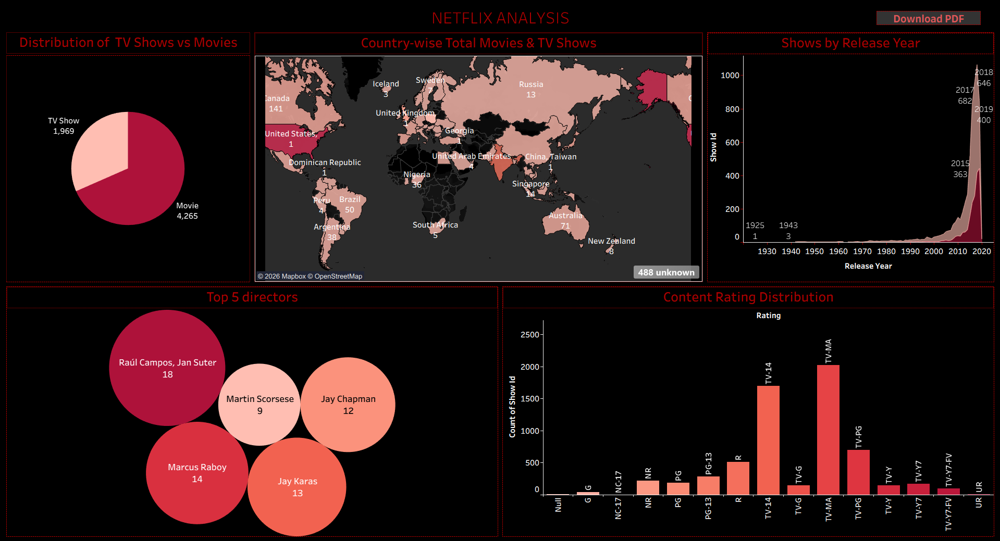

# Netflix Content Analysis

## Project Overview

This Tableau dashboard project analyzes Netflix movies and TV shows to uncover trends in content distribution, release patterns, ratings, and country-wise availability. The dashboard provides interactive visual insights into Netflix's global content library.

## Tools Used

* Tableau
* Excel

## Tableau Dashboard

This interactive dashboard helps analyze Netflix content trends using multiple visualizations and storytelling techniques.

### Dashboard Preview

## Dashboard Features

* Movies vs TV Shows Distribution
* Country-wise Content Analysis
* Release Year Trend Analysis
* Top 5 Directors
* Content Rating Distribution

## Key Insights

* Movies dominate Netflix content compared to TV shows
* Content releases increased rapidly after 2015
* The United States contributes the highest number of titles
* TV-MA is one of the most common content ratings
* Certain directors contributed significantly more content than others

## Skills Demonstrated

* Data Visualization
* Dashboard Design
* Trend Analysis
* Interactive Reporting
* Data Storytelling
